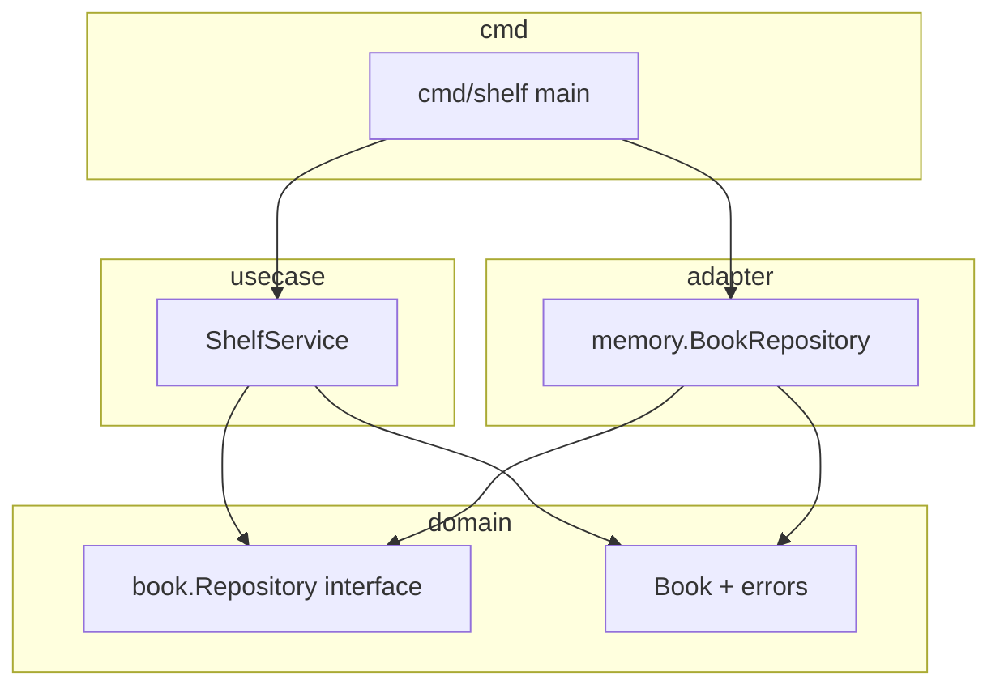

# 設計（このリポジトリの具体的な形）

`go_practice` の **本棚（Shelf）** を例に、レイヤーの役割と **呼び出しの流れ** を固定します。ファイル名は現状の構成に合わせています。

---

## 1. 解く問題（ドメインの仕様）

| 操作 | ふるまい |
|------|----------|
| 登録 | 新しい本を追加する。ID はアプリ側で採番する。初期状態は **貸出可能**。 |
| 借りる | ID で本を取り出し、**貸出可能なら**貸出中にする。すでに貸出中なら **AlreadyBorrowed**。 |
| 返す | ID で本を取り出し、**貸出中なら**貸出可能にする。貸出中でなければ **NotBorrowed**。 |
| 参照 | ID が無ければ **BookNotFound**。 |

「ルールの中身」（二重借り・未貸出返却）は **`internal/domain/book`** にだけ置く。

---

## 2. ディレクトリと責務（誰が何を知っているか）

```
cmd/shelf/              → プロセスの入口（main）。依存を組み立てるだけに薄くする。
internal/
  domain/book/          → Book エンティティ、ドメインエラー、Repository インターフェース（ポート）
  usecase/              → ShelfService。ユースケースの手順（Find → ドメイン操作 → Save）
  adapter/memory/       → Repository のインメモリ実装（アダプタ）
```

※ **Phase 2** では `repository.go` を **`internal/usecase` に寄せる**演習も行う（ポートの置き場の比較。詳細は §10）。

| 場所 | 責務 | してはいけない例 |
|------|------|-------------------|
| `domain/book` | 用語・不変条件・失敗の種類・永続化の **契約（interface）** | `net/http` や `database/sql` を import する |
| `usecase` | 採番・トランザクション境界のイメージ・リポジトリ呼び出しの並び | `Book` の内部フィールドを直接いじる（メソッド経由にする） |
| `adapter/memory` | `map` とロックで `Repository` を満たす | ビジネスルールをここに書く（Borrow の条件など） |
| `cmd/shelf` | `NewBookRepository` と `NewShelfService` を繋ぐ | 長い処理ロジックをべた書き |

---

## 3. 依存の向き（実装の指針）



- **`usecase` は `memory` を import しない**のが理想（テストで `memory` を使うのは **テストコード側** の都合でよい）。
- **`domain` は誰にも引っ張られない**（一番内側）。

---

## 4. 具体フロー: `RegisterBook`

1. `ShelfService.RegisterBook(ctx, title, author)` が呼ばれる。
2. `newBookID()` で **文字列 ID** を生成（例: 乱数を hex。ログや URL に載せやすい）。
3. `book.NewBook(id, title, author)` で **ドメイン上の本**を作る（初期は貸出可能）。
4. `repo.Save(ctx, b)` で永続化。エラーならそのまま返す。
5. 呼び出し元に **`b.ID()` を返す**（クライアントがあとで Borrow に使う）。

**設計上のポイント:** 採番は **ユースケース**（アプリケーション都合）。ISBN などドメインが決める識別子ならドメイン側に寄せる、という分け方もある。

---

## 5. 具体フロー: `BorrowBook`

1. `repo.FindByID(ctx, bookID)` → 無ければ **`book.BookNotFound`**。
2. `b.Borrow()` → ルール違反なら **`book.AlreadyBorrowed`**（ドメインが返す）。
3. `repo.Save(ctx, b)` → 変更後の状態を保存。

**ReturnBook** も同型で、`FindByID` → `Return()` → `Save`。

---

## 6. `book.Repository` が「ポート」である理由

- **ドメイン**は「本を保存・ID で取り出す」**能力**だけを interface で宣言する。
- **SQLite / PostgreSQL / メモリ**はその能力の **別実装（アダプタ）**。
- ユースケースは **`Repository` 型（interface）** だけを見るので、保存先を差し替えやすい。

このリポジトリでは `memory.BookRepository` がその実装。

---

## 7. インメモリ実装の設計上の注意（このコードベース固有）

`memory` の `Save` は **`bk := *b` で値コピーして map に格納**している。

- **効果:** 呼び出し側が渡した `*Book` をあとから勝手に変えても、map 内のコピーは勝手に変わらない（意図次第で「防御的コピー」になる）。
- **テストへの影響:** 一度 `FindByID` で取ったポインタは **`Save` 後は古い**可能性がある。**状態を検証するときは `FindByID` し直す**（[TESTING.md](./TESTING.md)）。

---

## 8. 並行環境でのインメモリ — Mutex 版と channel 版

同じ「`map` に `*Book` を載せるインメモリ `Repository`」でも、**複数 goroutine から同時に呼ばれる**前提を満たすやり方は複数あります。このリポジトリで扱うのは次の 2 系統です。

### 8.1 Mutex（`sync.RWMutex`）で直列化する — `adapter/memory`

- **考え方:** 複数 goroutine が **同じ map に直接触ってよい**が、**同時に触らない**よう Mutex で臨界区間を守る。
- **読み取り中心**なら `RLock`、**書き込み**は `Lock`。`Save` と `FindByID` が重なっても、map の整合性はロックが保証する。
- **長所:** コードが短く、読み慣れた人には追いやすい。Phase 1 の定番。
- **短所:** ロックの取り忘れ・デッドロック・細かい可視性の設計は人間の注意に依存。`-race` で炙る価値が高い。

### 8.2 channel と「係員 goroutine」で直列化する — `channelrepo` など

- **考え方:** **map に触れるのは常に 1 本の goroutine だけ**（係員）。他の goroutine は map を見ず、**依頼（メッセージ）を channel で送り、返事を channel で受け取る**だけ。これは **actor モデル**や **「共有メモリよりメッセージ」** の典型例です。
- **仕事用 channel（例: `ops chan request`）:** キュー。1 件の `request` には **操作種別（保存／取得）**、**ペイロード（`*Book` や ID）**、**呼び出し元へ返すための返信 channel** をまとめて載せることが多い。
- **係員のループ:** `for { select { case req := <-ops: ... } }` のように、届いた依頼を **1 件ずつ**処理し、map を更新または参照したうえで **`req.reply <- 結果`** のように返す。
- **長所:** 「誰が map を触るか」が 1 箇所に集約され、データ競合の構造的理由が減る。設計を説明しやすい（窓口と裏方の比喩）。
- **短所:** 型（`request`）や `select` が増え、行数は増えがち。**終了（shutdown）** と **goroutine リーク**をきちんと設計しないとテストや `main` で残りやすい。

### 8.3 公開 API に channel を出さない理由

`ShelfService` やテストが見るのは **`Save(ctx, b) error` / `FindByID(ctx, id)`** のような **同期っぽいメソッド**のままにします。channel は **アダプタ内部の実装詳細**に閉じ込めます。

- **境界の明確さ:** ユースケース層は「永続化の手段」を channel か Mutex かまで知らなくてよい。
- **テストの置きやすさ:** フェイク実装は map だけでも channel でも、**同じ interface** を満たせば差し替え可能。

### 8.4 channel 版で Mutex を二重にかけない理由

「`Save` メソッド内で Mutex を取りつつ、別 goroutine の係員も同じ map を触る」は **二重の並行モデル**になり、読み手が「どちらが本当の守り手か」迷います。**channel 版では map は係員だけ**、**Mutex 版では map はロックで守る**、と **どちらかに寄せる**のが実務的です。

### 8.5 返信 channel にバッファを付けることが多い理由

依頼 struct の中に **`reply chan error` や `reply chan findResult`** を埋め込むとき、**容量 1 のバッファ付き** `make(chan T, 1)` にすることが多いです。係員が `reply <- x` した瞬間に、呼び出し側がまだ受信していなくても **係員側がブロックしない**（デッドロックしにくい）からです。無バッファだと、送り手と受け手が同時に準備できている必要があり、設計を誤ると詰まりやすいです。

### 8.6 シャットダウンと `close(ch)` の注意

- **係員を止める**には、`done` channel の `close` や専用の shutdown シグナルを `select` に足すなどの設計が必要です（[TRAINING.md](./TRAINING.md) Phase 2 Step 5）。
- **仕事用 `ops` を `close` する**と、`for range ops` で係員は抜けられますが、**閉じた channel へ送ると panic** するため、「もう誰も `Save` しない」タイミングと整合させる必要があります。

---

## 9. コンストラクタと係員 — 待ち続けるのはどちらか

- **`NewChannelRepo()`（コンストラクタ）の仕事:** 仕事用 channel を `make` する、**係員を `go` で 1 回起動する**、フィールドを埋めた struct を **すぐ `return` する**。ここで **`Save` を呼ばない**。コンストラクタ本体が **`<-ch` で永遠にブロック**すると、呼び出し側に `*Repo` が返らず、以降のメソッド呼び出しもできません。
- **係員 goroutine の仕事:** **`for` + `select`** で依頼を待ち、処理したらまた待つ。**「ずっと channel を待つ」**のはこちらです。複数回の `Save` / `FindByID` に対応するためです。

詳細な実装手順は [IMPLEMENTATION.md](./IMPLEMENTATION.md) の channel 節を参照してください。

---

## 10. ポート（`Repository` interface）をどこに置くか

### 10.1 Phase 1（このドキュメント §2〜§6 の図）

- **`internal/domain/book` に `Repository` を置く**形を前提にしている。ドメインが「永続化に必要な能力」を宣言し、アダプタが実装する。
- **利点:** 「ドメインが依存しない純粋さ」と説明しやすい。DDD の教科書的な図と一致しやすい。

### 10.2 Phase 2 の演習（[TRAINING.md](./TRAINING.md) Step 1）

- **interface を `internal/usecase` に移す**練習をする。名前は `BookRepository` など。ドメインから `repository.go` を削除し、**エンティティとエラー**にドメインを寄せる。
- **Go の慣習との接続:** 「**interface は利用側（ここではユースケース）が定義する**」という書き方に慣れるのが目的のひとつ。テストでは **フェイク**が同じ interface を満たせばよい。

### 10.3 どちらが正解か

**どちらもプロダクトやチームの合意次第**です。ドメインに置くと「ルールと永続化契約が同じパッケージ」になり、ユースケースに置くと「アプリケーションが必要とするポートがユースケース近く」になります。トレードオフを **両方書いてみて**比較するのがこの Phase の狙いです。

§3 の mermaid は **Phase 1（`book.Repository`）** の依存の向きです。Phase 2 演習後は、`ShelfService` が参照する interface が **`usecase` パッケージ内の型**になるイメージへ読み替えてください（`memory.BookRepository` がその interface を実装する関係は同型です）。

---

## 関連ドキュメント

- 手を動かす順番: [TRAINING.md](./TRAINING.md)
- テストの書き方: [TESTING.md](./TESTING.md)
- ファイルごとの実装パターン: [IMPLEMENTATION.md](./IMPLEMENTATION.md)
