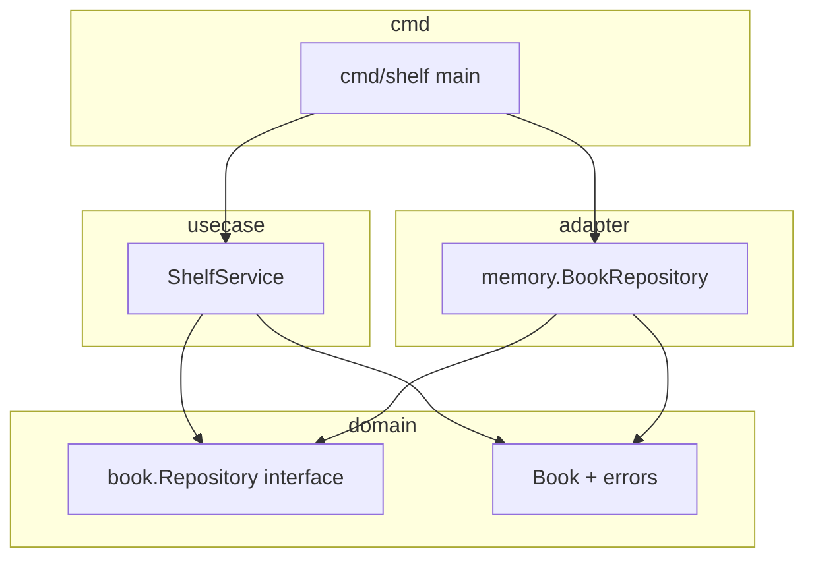

# 設計（このリポジトリの具体的な形）

`go_practice` の **本棚（Shelf）** を例に、レイヤーの役割と **呼び出しの流れ** を固定します。ファイル名は現状の構成に合わせています。

---

## 1. 解く問題（ドメインの仕様）

| 操作 | ふるまい |
|------|----------|
| 登録 | 新しい本を追加する。ID はアプリ側で採番する。初期状態は **貸出可能**。 |
| 借りる | ID で本を取り出し、**貸出可能なら**貸出中にする。すでに貸出中なら **AlreadyBorrowed**。 |
| 返す | ID で本を取り出し、**貸出中なら**貸出可能にする。貸出中でなければ **NotBorrowed**。 |
| 参照 | ID が無ければ **BookNotFound**。 |

「ルールの中身」（二重借り・未貸出返却）は **`internal/domain/book`** にだけ置く。

---

## 2. ディレクトリと責務（誰が何を知っているか）

```
cmd/shelf/              → プロセスの入口（main）。依存を組み立てるだけに薄くする。
internal/
  domain/book/          → Book エンティティ、ドメインエラー、Repository インターフェース（ポート）
  usecase/              → ShelfService。ユースケースの手順（Find → ドメイン操作 → Save）
  adapter/memory/       → Repository のインメモリ実装（アダプタ）
```

| 場所 | 責務 | してはいけない例 |
|------|------|-------------------|
| `domain/book` | 用語・不変条件・失敗の種類・永続化の **契約（interface）** | `net/http` や `database/sql` を import する |
| `usecase` | 採番・トランザクション境界のイメージ・リポジトリ呼び出しの並び | `Book` の内部フィールドを直接いじる（メソッド経由にする） |
| `adapter/memory` | `map` とロックで `Repository` を満たす | ビジネスルールをここに書く（Borrow の条件など） |
| `cmd/shelf` | `NewBookRepository` と `NewShelfService` を繋ぐ | 長い処理ロジックをべた書き |

---

## 3. 依存の向き（実装の指針）



- **`usecase` は `memory` を import しない**のが理想（テストで `memory` を使うのは **テストコード側** の都合でよい）。
- **`domain` は誰にも引っ張られない**（一番内側）。

---

## 4. 具体フロー: `RegisterBook`

1. `ShelfService.RegisterBook(ctx, title, author)` が呼ばれる。
2. `newBookID()` で **文字列 ID** を生成（例: 乱数を hex。ログや URL に載せやすい）。
3. `book.NewBook(id, title, author)` で **ドメイン上の本**を作る（初期は貸出可能）。
4. `repo.Save(ctx, b)` で永続化。エラーならそのまま返す。
5. 呼び出し元に **`b.ID()` を返す**（クライアントがあとで Borrow に使う）。

**設計上のポイント:** 採番は **ユースケース**（アプリケーション都合）。ISBN などドメインが決める識別子ならドメイン側に寄せる、という分け方もある。

---

## 5. 具体フロー: `BorrowBook`

1. `repo.FindByID(ctx, bookID)` → 無ければ **`book.BookNotFound`**。
2. `b.Borrow()` → ルール違反なら **`book.AlreadyBorrowed`**（ドメインが返す）。
3. `repo.Save(ctx, b)` → 変更後の状態を保存。

**ReturnBook** も同型で、`FindByID` → `Return()` → `Save`。

---

## 6. `book.Repository` が「ポート」である理由

- **ドメイン**は「本を保存・ID で取り出す」**能力**だけを interface で宣言する。
- **SQLite / PostgreSQL / メモリ**はその能力の **別実装（アダプタ）**。
- ユースケースは **`Repository` 型（interface）** だけを見るので、保存先を差し替えやすい。

このリポジトリでは `memory.BookRepository` がその実装。

---

## 7. インメモリ実装の設計上の注意（このコードベース固有）

`memory` の `Save` は **`bk := *b` で値コピーして map に格納**している。

- **効果:** 呼び出し側が渡した `*Book` をあとから勝手に変えても、map 内のコピーは勝手に変わらない（意図次第で「防御的コピー」になる）。
- **テストへの影響:** 一度 `FindByID` で取ったポインタは **`Save` 後は古い**可能性がある。**状態を検証するときは `FindByID` し直す**（[TESTING.md](./TESTING.md)）。

---

## 関連ドキュメント

- 手を動かす順番: [TRAINING.md](./TRAINING.md)
- テストの書き方: [TESTING.md](./TESTING.md)
- ファイルごとの実装パターン: [IMPLEMENTATION.md](./IMPLEMENTATION.md)
